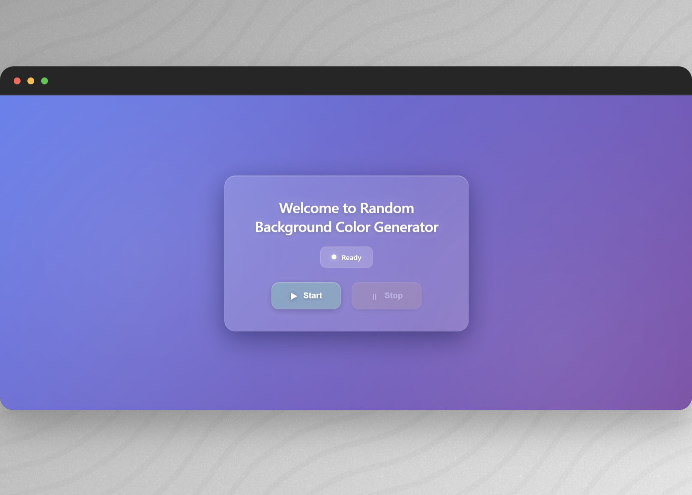

# 🎨 Random Background Color Generator (Glassmorphism UI)

A fun mini-project to learn **asynchronous JavaScript fundamentals** like `setInterval`, `clearInterval`, and UI state management — wrapped in a premium **liquid-glass / macOS-style** interface.



## 🚀 Demo

- Live Demo (GitHub Pages): _coming soon_
- Source Code: this repository

---

## ✨ Features

- ✅ Random **hex color generator** (`#000000` → `#FFFFFF`)
- ✅ Auto background change every **1000ms** using `setInterval`
- ✅ **Start / Stop** controls with clean interval cleanup (`clearInterval`)
- ✅ Real-time UI state:
  - Status: **Ready → Running → Stopped**
  - Pulsing dot animation when running
- ✅ Premium **Glassmorphism / Liquid Glass UI**
- ✅ (Advanced) Dynamic CSS rule manipulation via `document.styleSheets[0]`

---

## 🧠 What I learned (Async JS)

- `setInterval()` to schedule repeated tasks
- `clearInterval()` to stop scheduled tasks safely
- DOM event handling (`click` events)
- UI state synchronization (buttons + status + animations)
- CSS pitfalls: `background` shorthand overriding `background-color`

---

## 🧩 Project Structure

```txt
random-bg-color/
├─ index.html
├─ random-bg-color.css
├─ random-bg-color.js
└─ assets/
```
